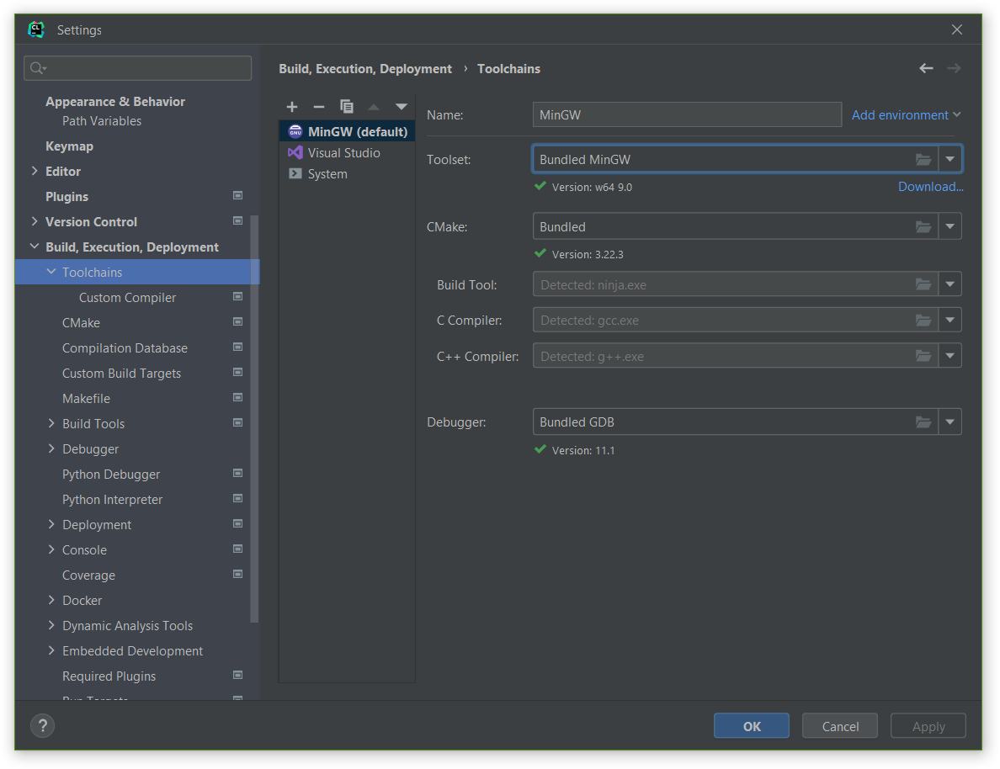
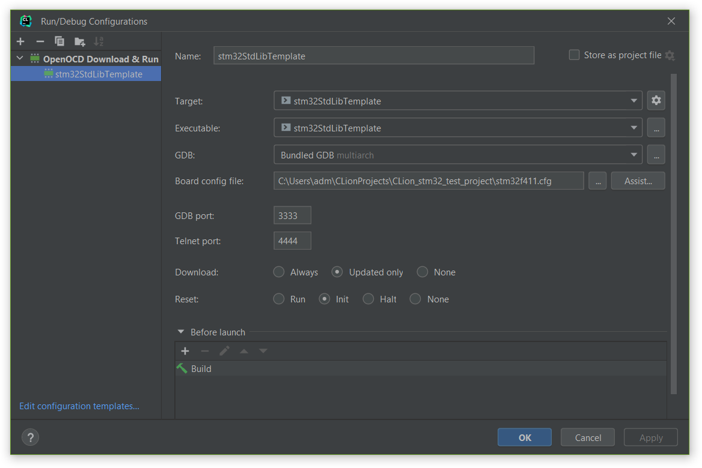

# Stm32 StdLib based template for CLion IDE (uses cmake)

This is a minimal Stm32 "hello world" project for CLion IDE based on [STM32 Standard Peripheral Library](https://www.st.com/en/embedded-software/stm32-standard-peripheral-libraries.html)

Target CPU is STM32F411CC

## How To
1. install [gcc-arm-none-eabi](https://developer.arm.com/downloads/-/gnu-rm) compiler set
2. make sure you can reach gcc-arm-none-eabi-gcc and gcc-arm-none-eabi-g++ from your shell (add bin directory (ex: C:\Program Files (x86)\GNU Arm Embedded Toolchain\10 2021.10\bin) to the system PATH variable)
3. make sure you can reach cmake from your shell. You can use the one shipped with you CLion distribution, ex: C:\Program Files\JetBrains\CLion 2021.3.3\bin\cmake\win\bin
4. setup toolchain `File -> Settings -> Build, Execution, Deployment -> Toolchains`:  
5. now you must be able to build the progect `Build -> Build Project`. You could attempt restarting you IDE in case of any problem
6. add debug configuration `Run -> Edit Configurations`. Choose the only available `Target` and `Executable`, select `Boarding config file` from the project root: 
7. at this point you must be able to run and debug your source code: `Run -> Debug stm32StdLibTemplate`
8. in order to view peripherals state during debug you have to provide a `*.svd` file, located at the project root directory: `STM32F411.svd` (Search in the internet if you need any other)